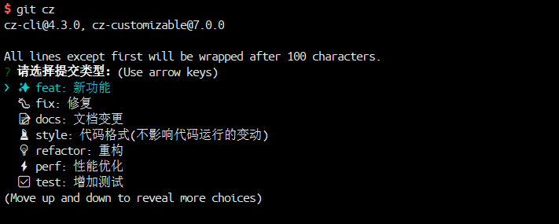

# git-commit-style-guide


### 目的

* **统一团队 `Git commit` 日志标准，便于后续代码 review，版本发布以及日志自动化生成等等**。
* **统一团队的 Git 工作流，包括分支使用、tag 规范、issue 等**

### Git commit 日志参考案例

* [angular](https://github.com/angular/angular)
* [commit-message-test-project](https://github.com/cpselvis/commit-message-test-project)
* [babel-plugin-istanbul](https://github.com/istanbuljs/babel-plugin-istanbul)
* [conventional-changelog](https://github.com/conventional-changelog/conventional-changelog)

### 总体方案


### Git commit日志基本规范

```
<type>(<scope>): <subject>
<BLANK LINE>
<body>
<BLANK LINE>
<footer>
```

**所有的 type 类型如下：**

> type代表某次提交的类型，比如是修复一个bug还是增加一个新的feature。

* feat： 新增 feature
* fix: 修复 bug
* docs: 仅仅修改了文档，比如 README, CHANGELOG, CONTRIBUTE等等
* style: 仅仅修改了空格、格式缩进、逗号等等，不改变代码逻辑
* refactor: 代码重构，没有加新功能或者修复 bug
* perf: 优化相关，比如提升性能、体验
* test: 测试用例，包括单元测试、集成测试等
* chore: 改变构建流程、或者增加依赖库、工具等
* revert: 回滚到上一个版本

**格式要求：**

```
# 标题行：50个字符以内，描述主要变更内容
#
# 主体内容：更详细的说明文本，建议72个字符以内。 需要描述的信息包括:
#
# * 为什么这个变更是必须的? 它可能是用来修复一个bug，增加一个feature，提升性能、可靠性、稳定性等等
# * 他如何解决这个问题? 具体描述解决问题的步骤
# * 是否存在副作用、风险? 
#
# 尾部：如果需要的化可以添加一个链接到issue地址或者其它文档，或者关闭某个issue。
```

### Git分支与版本发布规范

* 基本原则：master为保护分支，不直接在master上进行代码修改和提交。
* 开发日常需求或者项目时，从master分支上checkout一个feature分支进行开发或者bugfix分支进行bug修复，功能测试完毕并且项目发布上线后，`将feature分支合并到主干master，并且打Tag发布，最后删除开发分支`。分支命名规范：
    * 分支版本命名规则：分支类型 _ 分支发布时间 _ 分支功能。比如：feat_20170401_fairy_flower
    * 分支类型包括：feat、 fix、refactor三种类型，即新功能开发、bug修复和代码重构
    * 时间使用年月日进行命名，不足2位补0
    * 分支功能命名使用snake case命名法，即下划线命名。
* Tag包括3位版本，前缀使用v。比如v1.2.31。Tag命名规范：
    * 新功能开发使用第2位版本号，bug修复使用第3位版本号
    * 核心基础库或者Node中间价可以在大版本发布请使用灰度版本号，在版本后面加上后缀，用中划线分隔。alpha或者belta后面加上次数，即第几次alpha：
        * v2.0.0-alpha.1 
        * v2.0.0-belta.1
* 版本正式发布前需要生成changelog文档，然后再发布上线。

### 如何接入？

接入参考[git-commit-style-guide](https://github.com/feflow/git-commit-style-guide)项目。 具体步骤如下：

* 第一步：在工程根目录下的 `package.json` 文件加入如下代码所示的 `scripts` 、`config` 和 `dependencies` 内容，版本号为3位版本号。

```json
{
  "name": "application-name",
  "version": "0.1.0",
  "scripts": {
    "commitmsg": "validate-commit-msg",
    "commit": "git-cz",
    "changelog": "conventional-changelog -p angular -i CHANGELOG.md -s -r 0"
  },
  "config": {
    "commitizen": {
      "path": "node_modules/cz-customizable"
    }
  },
  "devDependencies": {
    "cz-customizable": "^7.0.0",
    "husky": "^0.13.1",
    "validate-commit-msg": "^2.11.1"
  }
}
```

* 第二步：在工程根目录新建 `.vcmrc` 文件，并且文件内容为

```json
{
  "helpMessage": "\nPlease fix your commit message (and consider using https://www.npmjs.com/package/commitizen)\n",
  "types": [
    "feat",
    "fix",
    "docs",
    "style",
    "refactor",
    "perf",
    "test",
    "chore",
    "revert"
  ],
  "warnOnFail": false,
  "autoFix": false
}
```

* 第三步：在工程根目录下新建 `.cz-config.js` 文件，文件内容为

```js
module.exports = {
    // 可选类型
    types: [
        { value: 'feat', name: '✨  feat: 新功能' },
        { value: 'fix', name: '🐛 fix: 修复' },
        { value: 'docs', name: '📝 docs: 文档变更' },
        { value: 'style', name: '💄 style: 代码格式(不影响代码运行的变动)' },
        { value: 'refactor', name: '💡 refactor: 重构' },
        { value: 'perf', name: '⚡️  perf: 性能优化' },
        { value: 'test', name: '✅  test: 增加测试' },
        { value: 'chore', name: '🔨 chore: 构建过程或辅助工具的变动' },
        { value: 'revert', name: '↩️  revert: 回退' }
    ],
    // 消息步骤
    messages: {
        type: '请选择提交类型:',
        customScope: '请输入修改范围(可选):',
        subject: '请简要描述提交(必填):',
        body: '请输入详细描述(可选):',
        breaking: '请列出所有的破坏性变更，例如：描述、理由或迁移方式等(可选):',
        footer: '请输入要关闭的issue(可选):',
        confirmCommit: '确认使用以上信息提交？(y/n/e/h)',
    },
    // 跳过问题
    skipQuestions: ['footer'],
    // subject文字长度默认是72
    subjectLimit: 72,
    allowCustomScopes: true,
    allowBreakingChanges: ['feat', 'fix']
}
```

* 第四步: 安装所需的工具

*全局安装 `commitizen` `conventional-changelog-cli`*

```sh
npm install -g commitizen conventional-changelog-cli
```

*在项目根目录执行 `npm install` 安装 `cz-customizable` `validate-commit-msg` `husky`*

```sh
npm install
```

### 接入后的 Git commit 操作流程

* 第一步：创建一个feature分支或者bugfix分支

```sh
$ git checkout -b feature_infinite_load    # 切换到一个feature分支或者bug fix分支
```

* 第二步：将代码提交到本地 Git 仓库，并填写符合要求的 Commit message 格式

```sh
$ git add .
$ git cz   # 使用 git cz 代替 git commit
```

> 注意: 使用 git commit 提交时，不要加参数， 例如 -m

如下图所示：




* 第三步：将代码同步到远程Git仓库

```sh
$ git push origin feature_infinite_load    # 将修改发布到远程仓库 
```

* 第四步：自动生成changelog，并打Tag发布

```sh
$ npm run changelog                    # 使用 npm script 中的 changlog 命令直接从git元数据生成日志。
$ git tag v0.1.0
$ git push origin v0.1.0
```
